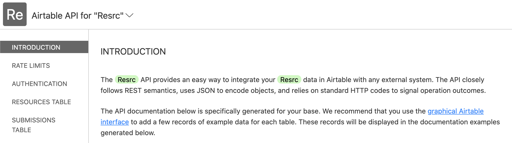

One of the side projects that I run is [Resrc](https://resrc.dev/), a site where I curate useful or interesting resources for software development.

Since the site is typically updated once a day and does not offer complex dynamic features, I decided to go with a static site architecture also known as [Jamstack](https://jamstack.org/). The actual tech stack that I went with is [Airtable](https://airtable.com/) for the database and [Gatsby](https://www.gatsbyjs.com/) for the static site generator. This works extremely well because of Gatsby's data source plugin system to allow pulling in data from Airtable at build time with ease.

However, people tend to question this architecture...

> How do I add a dynamic feature, such as search, to a static site?

It is possible, but requires a different set of tools than what you might traditionally be used to. In my case, I already used those tools: Airtable and Netlify.

## 📊 Storing and querying data with [Airtable](https://airtable.com/)

[Airtable](https://airtable.com/) is a service that looks like a spreadsheet but behaves like a database.


The best part is you get access to a full API:



The API has advanced filtering capabilities which allows performing a full text search on various fields of my data, realtime. I got really excited because I thought: now I just build out a search UI, send an ajax request to fetch results, and I'm done!

_Hmm, not quite._ Airtable currently does not have access control features, meaning that if I exposed my API key on the frontend then anyone could submit a request to delete my data. That is not exactly what I would call secure.

Note that this article intends to be a tutorial, so to continue on I recommend that you [create an Airtable base](https://support.airtable.com/hc/en-us/articles/202578749-Creating-a-new-empty-base), [add some records](https://support.airtable.com/hc/en-us/articles/216108577-Adding-a-new-record#:~:text=You%20can%20add%20a%20new,%2Fbelow%22%20from%20the%20menu.), and then [check out the API](https://airtable.com/api).

## 🔑 Securing the API key with [Netlify Functions](https://www.netlify.com/products/functions/)

[Netlify](https://www.netlify.com/) is a service that handles deploys for static sites. Amongst many features that are useful for static sites, they offer serverless functions. While [AWS Lambda](https://aws.amazon.com/lambda/) is used under the hood, you don't have to worry about complex implementation details.

The reason that we'd want to use serverless functions is because they provide a way of proxying our requests to the Airtable API, thus hiding our API key. Instead of the frontend making direct requests to Airtable, it is made to the serverless function.

<Alert>

**Note**: This tutorial assumes that you already created a site with a static site generator such as [Gatsby](https://www.gatsbyjs.com/), [Next.js](https://nextjs.org/) or [Eleventy](https://www.11ty.dev/).

</Alert>

To set up Netlify Functions, we first need to create a `netlify.toml` file:

```toml
[build]
  functions = "functions"
```

Let's also store our API key in a `.env` file:

```
AIRTABLE_API_KEY=PLACEHOLDER
```

Make sure that `.env` files are [ignored by Git](https://docs.github.com/en/free-pro-team@latest/github/using-git/ignoring-files) and thus never committed to your repository. You will also have to add this key as an [environment variable in Netlify](https://docs.netlify.com/configure-builds/environment-variables/).

Next, create the file `functions/search.js`:

```js
const Airtable = require('airtable');

const AIRTABLE_API_KEY = process.env.AIRTABLE_API_KEY;
const AIRTABLE_BASE_ID = 'PLACEHOLDER'; // TODO: Replace placeholder.
const AIRTABLE_TABLE_NAME = 'PLACEHOLDER'; // TODO: Replace placeholder.
const AIRTABLE_PAGE_SIZE = 30;

const RESPONSE_HEADERS = {
  'Content-Type': 'application/json; charset=utf-8',
};

exports.handler = async function (event) {
  const { query } = event.queryStringParameters;

  if (!query) {
    return {
      statusCode: 422,
      body: JSON.stringify({ error: 'Query is required.' }),
    };
  }

  if (!AIRTABLE_API_KEY) {
    return {
      statusCode: 500,
      body: JSON.stringify({ error: 'Airtable API key is missing.' }),
    };
  }

  const base = new Airtable({ apiKey: AIRTABLE_API_KEY }).base(
    AIRTABLE_BASE_ID
  );

  const results = await base(AIRTABLE_TABLE_NAME)
    .select({
      pageSize: AIRTABLE_PAGE_SIZE,
      // TODO: Update to use your field names.
      filterByFormula: `
      OR(
        SEARCH("${query.toLowerCase()}", LOWER({Name})),
        SEARCH("${query.toLowerCase()}", LOWER({Description})),
        SEARCH("${query.toLowerCase()}", LOWER({Category})),
        SEARCH("${query.toLowerCase()}", LOWER({URL}))
      )
    `,
    })
    .firstPage()
    .catch((error) => {
      console.log(`Search error from Airtable API: ${error.message}`);
      return null;
    });

  const noResults = !Array.isArray(results) || results.length === 0;

  if (noResults) {
    return {
      statusCode: 404,
      body: JSON.stringify({ error: 'No results.' }),
    };
  }

  return {
    statusCode: 200,
    headers: RESPONSE_HEADERS,
    body: JSON.stringify({ results }),
  };
};
```

Make sure to replace the `// TODO` comments with your own keys and fields.

Let's now install the [Airtable JavaScript client](https://github.com/Airtable/airtable.js) and [Netlify CLI](https://docs.netlify.com/cli/get-started/):

```sh
npm install airtable
npm install netlify-cli --dev
```

And connect our Netlify account:

```sh
npx netlify login
```

Finally, we can launch our development server:

```sh
npx netlify --command="npm run develop"
```

Replace `npm run develop` with the command you normally use to start your server.

Our search results can now be accessed at the following search endpoint: [http://localhost:8888/.netlify/functions/search?query=test](http://localhost:8888/.netlify/functions/search?query=test)

## ⚛️ Fetching data efficiently with [React Query](https://react-query.tanstack.com/)

[React Query](https://react-query.tanstack.com/) is an amazing data fetching library but is optional because you can go ahead and create your frontend however you'd like. For example, you could create an HTML form and send a request to the search endpoint using the [Fetch API](https://developer.mozilla.org/en-US/docs/Web/API/Fetch_API).

However, I put React Query in the title of this article so I am obligated to share how I implemented a more efficient fetching strategy for Resrc. Let's jump into it.

### 🔎 The Search component

The component should provide a standard form with state management:

```jsx
import React, { useState } from 'react';

export default function Search() {
  const [query, setQuery] = useState('');

  const handleSubmit = (event) => {
    event.preventDefault();
    window.location.href = `/search?query=${query}`;
  };

  return (
    <form onSubmit={handleSubmit}>
      <input
        placeholder="Search..."
        aria-label="Search query"
        onChange={(event) => setQuery(event.target.value)}
        value={query}
        required
      />

      <button type="submit">Submit</button>
    </form>
  );
}
```

For Resrc, I have the search form displayed in the header. This is why I made the decision to navigate to a `/search` route whenever the form is submitted. This...

- Allows sharing the search results page URL.
- Simplifies data fetching to be on page load.

Also note that in a single page app you should use a client side route navigation instead. Gatsby provides a [navigate helper](https://www.gatsbyjs.com/docs/gatsby-link/#how-to-use-the-navigate-helper-function) and Next.js provides a [useRouter hook](https://nextjs.org/docs/api-reference/next/router#userouter).

### ⚓️ The useSearch hook

Okay, now let's fetch some data! Create a search page and component in your site:

```jsx
import React, { useState, useEffect } from 'react';
import { useQuery } from 'react-query';

const SEARCH_API_ENDPOINT = '/.netlify/functions/search';

const fetchSearch = async (key, query) => {
  if (!query) {
    throw new Error('Search query is required.');
  }

  return fetch(
    `${SEARCH_API_ENDPOINT}?query=${encodeURIComponent(query)}`
  ).then(async (response) => {
    const data = await response.json();

    if (response.status !== 200) {
      const error = new Error(data.error || 'Unknown error');
      error.statusCode = response.status;
      throw error;
    }

    return data;
  });
};

function useSearch(query) {
  return useQuery(['search', query], fetchSearch);
}

function SearchResultsPage() {
  const [query, setQuery] = useState(null);
  const { isLoading, isSuccess, isError, data, error } = useSearch(query);

  useEffect(() => {
    const query = new URLSearchParams(window.location.search).get('query');
    if (query) setQuery(query);
  }, []);

  if (isLoading) return 'Loading...';

  if (isError && error.statusCode === 404) return 'No results';

  if (isError) return error.message;

  if (isSuccess) {
    return (
      <ul>
        {data.results.map((result) => (
          <li key={result.id}>{JSON.stringify(result)}</li>
        ))}
      </ul>
    );
  }

  return null;
}
```

Note how we abstracted the data fetching into a custom hook called `useSearch`.

With that, the search functionality is now finished:

1.  Type `test` into the search form and press Enter.
2.  Page is navigated to `/search?query=test`
3.  React Query fetches results from `/.netlify/functions/search?query=test`
4.  Results are rendered depending on loading, success, or error status.

Note that I didn't provide any design here so it's up to you to decide how best to display the data. However, you can quickly spruce up the experience by implement a ready made design component system such as [Chakra UI](https://chakra-ui.com/). I use it for Resrc.

## 🎁 Wrapping up

Let's quickly recap the different layers of our realtime search stack:

- Airtable provides a full text search API to query the data we have stored.
- Netlify Functions proxies our API requests to Airtable and hides the API key.
- React Query fetches search results with some added features such as caching.

If you get stuck, feel free to reference the [source code of Resrc on GitHub](https://github.com/sunnysingh/resrc.dev). You are also always free to send me [an email](/contact) or [or a tweet](https://twitter.com/sunnysinghio) with questions or feedback.
