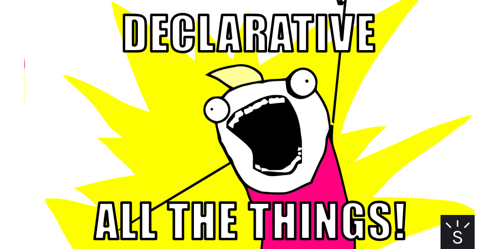

<Alert>
  This article was originally published to{' '}
  <AlertLink href="/news">the newsletter</AlertLink>.
</Alert>



I'm basically the hype person from that "all the things!" meme when it comes to declarative programming, but that recently got me thinking in how common the declarative/imperative terminology actually is among both junior and senior level developers.

Luckily, I got a few good albeit mixed responses to this question on Twitter.

> We learned both styles first year of University.
>
> — [@JamesIvings](https://twitter.com/JamesIvings/status/1105671627675787264)

---

> Quite senior in my case
>
> — [@cullophid](https://twitter.com/cullophid/status/1105717103116603392)

---

> Coming from a non-computer science background, I started coming across these terms relatively recently in my web development career (15+ years).
>
> Also, I’ve worked with a lot of folks with computer science backgrounds, and I can’t recall a single time we used imperative and declarative terminology for anything.
>
> — [@LashaKrikheli](https://twitter.com/LashaKrikheli/status/1109586323634118656)

For the most part, it depends on whether you self learned programming, in which case these terms may not be so common. However, Lasha points out that it's not even common among those who have computer science degrees.

Personally, this is terminology that I started using a ton once I learned about it, but it's definitely a form of jargon even to those within the industry. I initially came across the word "declarative" on React's website which they still use today:

> Declarative views make your code more predictable and easier to debug.
> — [reactjs.org](https://reactjs.org/)

If it's complex jargon though, should we stop using it?

## But wait, what is declarative anyway?

To write in a **declarative** style, your code should explain **what** you want to happen.

Let's use React as an example. I want a button to change text when it's clicked, so I'd write:

```jsx
<button onClick={() => setClicked(true)}>
  {isClicked ? 'Clicked!' : 'Click'}
</button>
```

Even if you're not familiar with React, the code is easy to follow due to its declarative nature.

You could do the same in an **imperative** style, but then your code would explain **how** you'd want it to happen.

This means that you'd use the DOM to select elements and update manually. Something like this:

```js
document.querySelector('#myButton').addEventListener('click', event => {
  event.target.innerHTML = 'Clicked!';
});
```

Compared to the declarative example, the imperative one is doing a lot of manual work in selecting elements and updating them.

Let's see another example with something a bit more familiar: loops.

```js
const letters = ['a', 'b', 'c'];
const filtered = [];

for (let index = 0; index < letters.length; index++) {
  const letter = letters[index];
  if (letter !== 'c') {
    filtered.push(letter);
  }
}

console.log(filtered); // a, b
```

I looped through the `letters` array and created a new `filtered` array without the letter "c". Do you see something wrong with this? It's actually an **imperative** style, which is something that you want to avoid especially with the amount of code for a simple task.

Let's see a **declarative** example:

```js
const letters = ['a', 'b', 'c'];

const filtered = letters.filter(letter => letter !== 'c');

console.log(filtered); // a, b
```

Woah, what happened? Declarative happened. Manually looping over an array just to filter a value out is too much of **how**. Instead, you want to describe **what** you want, which is exactly what the [Array.filter](https://developer.mozilla.org/en-US/docs/Web/JavaScript/Reference/Global_Objects/Array/filter) method allows you to do.

Hopefully at this point, you understand not only the differences between declarative and imperative styles, but also the benefits that declarative code can provide.

## Talk declarative to me

Jargon, despite its negative connotations, is a quite useful communication tool. When I'm reviewing someone else's code, it's much easier to suggest they make it more declarative than to provide specific explanations and examples. It essentially can save a lot of time in discussing code when everyone are familiar with the imperative and declarative patterns and terminology.

The unfortunate realization that I've had is that these terms are not quite popular, making it confusing jargon rather than useful jargon.

The solution? I would say more usage of these terms to introduce it into common programming vocabulary, as well as articles and tutorials on how code can be written in both imperative and declarative ways.
