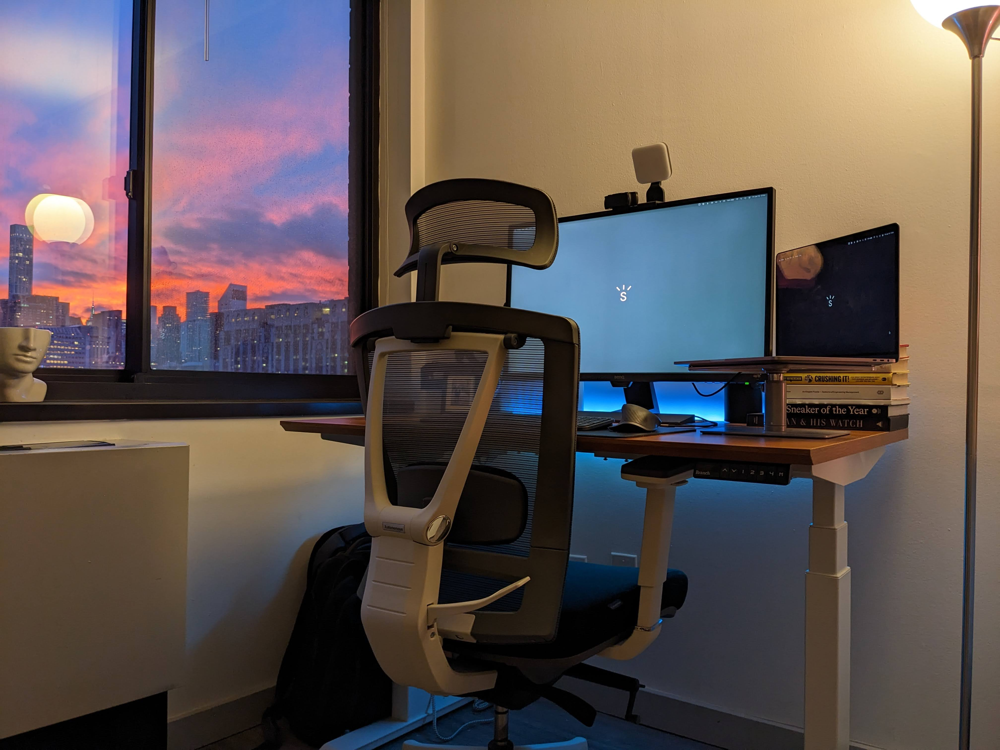
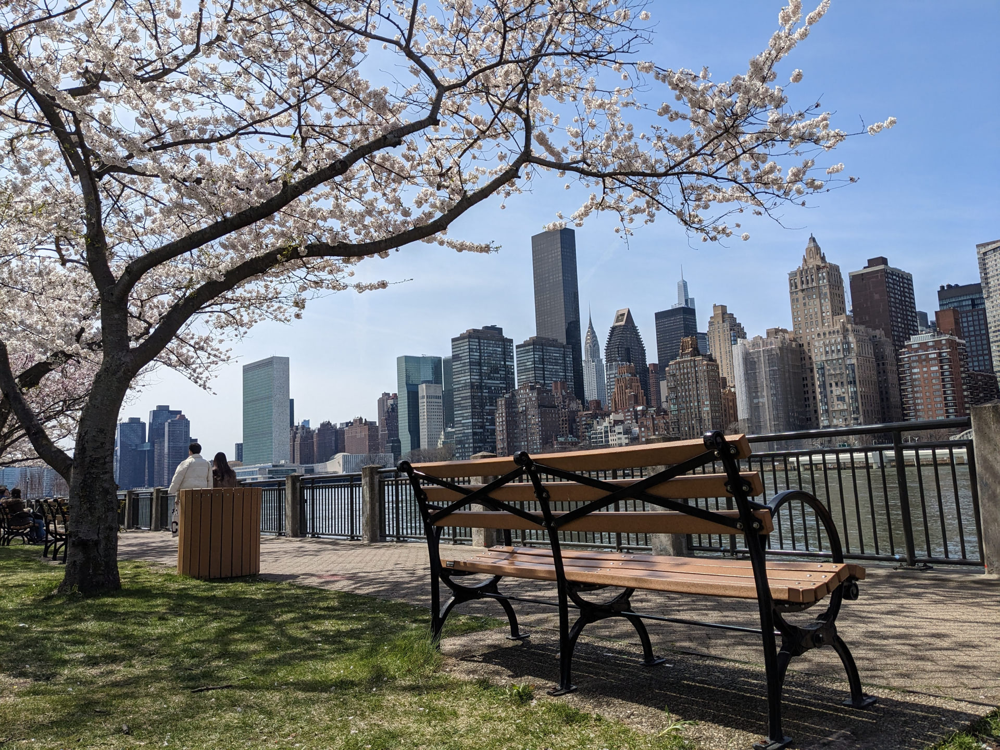
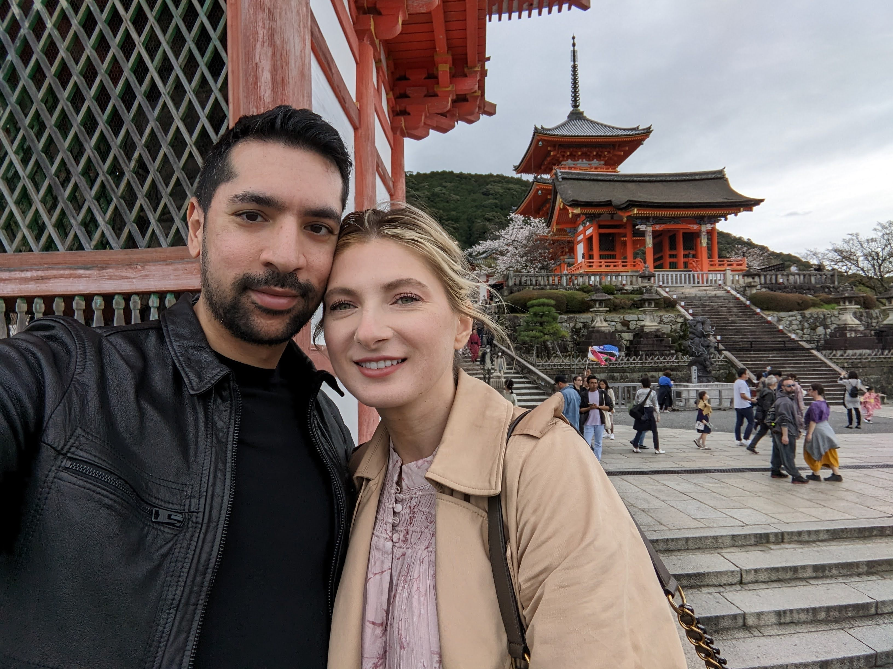
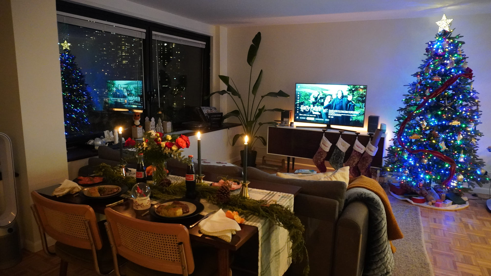
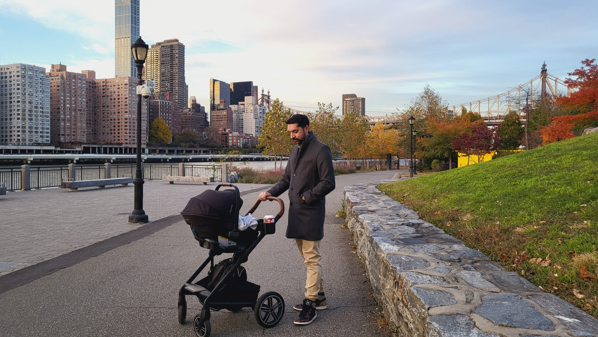
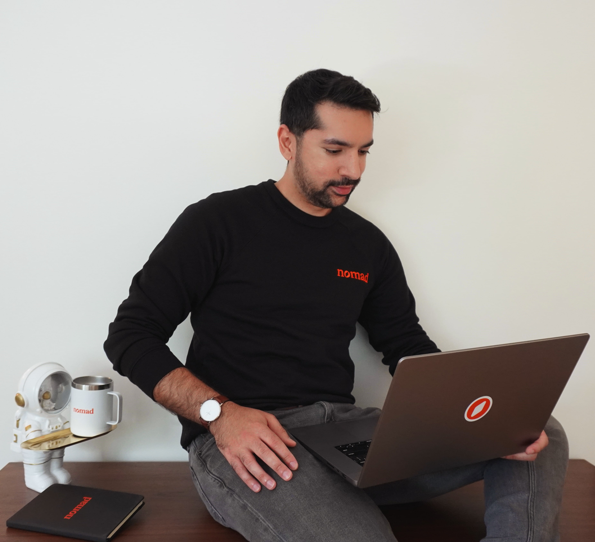
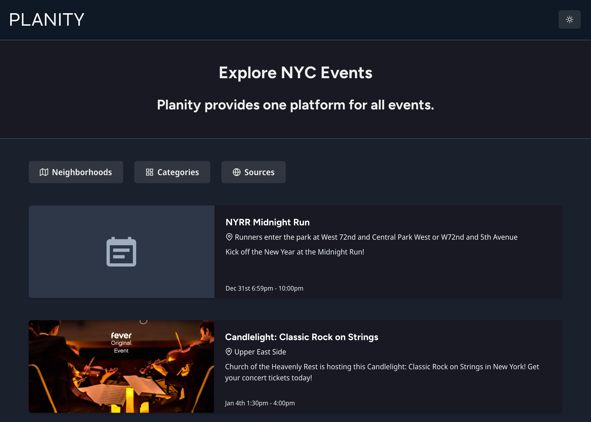
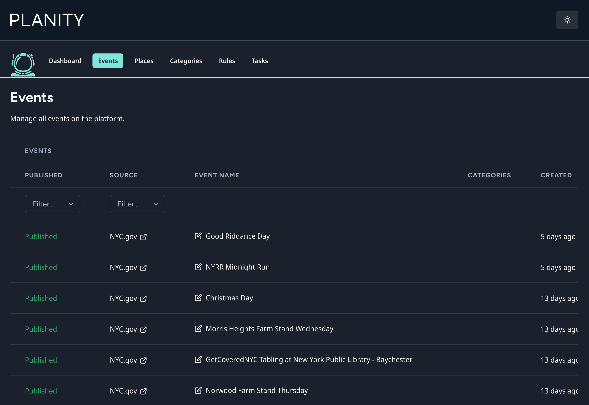

Five years ago, I wrote a [year in review](/blog/looking-back-on-2018) about all of my accomplishments throughout 2018. At that time, my focus was on my startup, coding projects, and content creation. Compared to 2023, and my life was centered around more personal accomplishments. However, there was one commonality: I planned the trajectory of both years all in the first month. Success tends to be shared as celebration of the present, and not often enough a review of the past. Let's dive in and figure out what a bench has anything to do with planning.

## The journey begins

I had a refreshing start to the year. With what feels like a never ending frigid winter in New York City, there isn't much to do aside from staying cozy at home, organizing, and working. At this point I had a clean and functional desk setup back from May of 2022 when we moved to Roosevelt Island. We had purposefully selected this rental apartment with a solid view of Manhattan, which presented many ember sunsets.

I thought that I would handle this new year with my usual routine: plan out new videos for my [YouTube channel](https://www.youtube.com/@SunnyNYC), write more [articles](/blog), and continue to build up my portfolio of web [projects](/projects). While I did have some ideas in mind, you'll soon learn that I would have more important things planned out ahead, and thus my online content creation and side project coding was put on pause. However, there is one project that I've been consistently working on in private, which I will reveal later on.

Something that I have learned with having so many different creative outlets is that while I do enjoy producing videos, writing articles, and building software products, they all require time and effort to be worthwhile. A YouTube channel, blog, or app does not grow without a consistent schedule of releases. Just about every online personality you see with success has failed a lot at first, and was required to put in countless hours of dedication to the craft. Most importantly though, how is success defined? It depends on the person, and this is something I've also learned about myself throughout 2023. I thought that I was an entrepreneur at heart, but in reality I most enjoy software engineering. Not every industry is a long term passion of mine, and as an introvert I enjoy a fairly quiet life. It's a freeing realization.

I still do appreciate a routine though; my wife Tanya and I would often grab coffee and walk around our slice of the city. There was a bench that we gravitated towards because of the inspiring view, and thus where we'd also plan our life.

All of the milestones that I had this year did not happen perchance. Thanks to our initial walks in January and chats on that bench, we decided every major milestone that we wanted to hit for the entire year. Yes, every single one.

## Turning thirty

The first major milestone happened in March: I turned 30 years old. It feels like only yesterday when I was a 20-something kiddo, starting my first big corporate job at Bank of America, and where I happened to have met my wife. I had learned so much in my 20s by exploring different industries, creating numerous side projects, traveling, and even moving cities. In my 30s, I want to hone in on the important things.

So how did I celebrate? By visiting the top country on my bucket list: Japan!

It wasn't something that I had personally prepared, my wife did it all from the initial idea to the final itinerary. There is no better gift than the trip of a lifetime, hitting spectacular spots in Tokyo, Kyoto, and even Mt. Fuji. I always loved Japanese culture, including anime, games, and obviously the ramen and sushi. We both enjoyed the trip despite the massive culture shock, and definitely look forward to coming back.

Celebrating a birthday maybe doesn't sound like an accomplishment on its own, but it's my next few milestones that really made it quintessential. They were even already in progress by the time I was in Japan, thus making the birthday more special.

## Building a home

Back in February, we started to tour a few apartments that appeared on the market for purchase. By the time that we were in Japan, we had already went through a lengthy underwriting process and entered the final approval stages. It's definitely out of touch to talk about purchasing a house these days though, considering the conversations focused on the millenial generation and overall affordability of everything. While that all may be true, we've been saving for the down payment since 2020 while also carefully researching the right neighborhoods and prices.

A side effect of the pandemic in NYC was that countless rental appartments provided dramatic discounts and incentives. Thus, we were able to live in neighborhoods that we otherwise could not. My wife and I pondered the idea of moving a little bit farther out, to Roosevelt Island, but we were not fans at first. Roosevelt Island is in close proximity to Manhattan, but it's a small and secluded sliver of land in the East River. As time passed by though, we realized how glorious it was to have a sanctuary away from the Manhattan madness, while having many quick ways to transport ourselves to work, appointments, and special events.

The dichotomy of living on Roosevelt Island though is that you're still subjected to NYC apartment living issues; apartments tend to be quite small and old, so before moving in we had an immediate renovation project to do.

I'll save you the stressful details of the renovation and move, just know that it worked out well! Here's a recent photo of our living room during Christmas:

The building is from the 1970s and our mid-century modern aesthetic fit right in. While there is still work to be done here, it is nice to know that we are investing into a long term asset and that yearly apartment moves is now a memory.

## Growing the family

It is getting quite difficult to continue writing this article while still holding an even bigger secret, so now for the reveal: we had a baby! You can already guess, we planned for this back in January, on that bench during our walks.

In September, a month before birth, we commemorated with a photoshoot:

This entire process has been surreal, and despite the tremendous amount of work that goes into growing a baby, I must say that I have not felt as joyous as I do here now sitting next to my two month old son. This is only the start to our family journey but I am already cherishing all of the moments that we're spending together.

## Ranking up my career

Work this year was full of surprises. I worked on critical backend automations, a new multi-platform design system, a rebrand, and developer tools. I also celebrated my four year work anniversary at [Nomad Health](https://nomadhealth.com/) which in similarity to my birthday is an accumulation of all the achievements I've made in the previous years.

I am thankful for the plethora of complex projects that I work on, as I exponentially grow my skills each time with them. Over time I gain the experience to speak with more affirmation and use my experience to help save time by keeping platforms maintainable for the long term. My next milestone is to be a staff level engineer.

## Future endeavors

As promised, I was going to share the current state of my projects, as well as reveal some details around a new project which I have been working on in private.

I have always had at least one project ongoing. My most recent one was [IronMic](https://ironmic.fm/), but I recently shut it down because of my lack of interest in the podcasting industry. That now leaves my personal site and content creation channels such as [YouTube](https://www.youtube.com/@SunnyNYC) and [Resrc](https://resrc.dev/), although I have not kept them up to date. My long term plan is to slowly get back into creating content, starting with articles before doing video.

So while I don't currently maintain a released product, I have been working on one in secret since December of 2021. Such a long development period goes against my previous experience of quick MVP launches, but I've personally learned that not every project must be a business. A healthier routine for me is to steadly contribute to the project in my spare time, release it when it's ready, and monetize it only when it gains enough traction. This strategy has another benefit too, that is it helps me understand if I still care enough to solve the problem I initially set out to.

With all that said, here's what it currently looks like:

Planity, which is a combination of the words _plan_ and _city_, is a site where you can plan things to do in your city. The problem that I have in a city like New York is that there are so many possible events happening each day, but it's time consuming to find something relevant throughout all of social media and the web. Thus, I am building a platform for event discovery and management, with the differentiator here that events are crawled from existing sources rather than created manually.

Here's a preview of the custom CMS on admin side:

I won't reveal much more, although I also have learned that first to market or zero competitors is not necessarily a good thing. I think that Planity will solve the problem in a unique enough way, such that even AI cannot disrupt it. However, I am interested to learn how to incorporate AI-powered features here.

The project is not open sourced, but I am a fan of the tech stack for web apps like this, and it has held up well for the past two years so far. Planity is built so far with [Turborepo](https://turbo.build/repo), [TypeScript](https://www.typescriptlang.org/), [Next.js](https://nextjs.org/), [Prisma](https://www.prisma.io/), [tRPC](https://trpc.io/), and [Chakra UI](https://chakra-ui.com/).

In relation to my previous milestones, I will be integrating my side project work into my life. Planity will likely be released at first with a small focus area, for example: family friendly events in NYC. I will also prioritize my side project work with scrutiny due to my now precious time outside of core responsibilities.

## Find your bench

2023 was a wild year, not only for the milestones that I shared but also generally for the world. I am curious with what the future holds but one thing I know is this, my wife and I, and my son, will be revisiting that bench to plan again.

I hope that you find your own bench and have a successful 2024.
