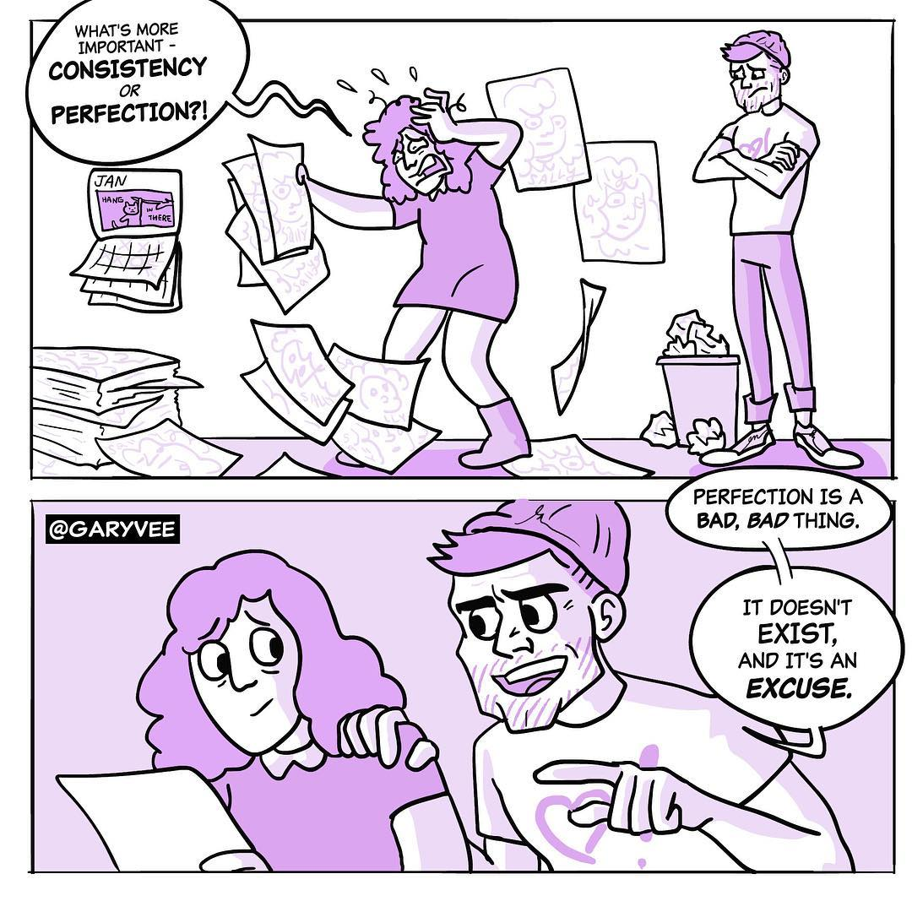

<Alert>
  This article was originally published to{' '}
  <AlertLink href="/news">the newsletter</AlertLink>.
</Alert>

In my [personal branding article](/blog/personal-brand), I talked a lot about personal branding and the importance of being consistent. But I'm sure that some of you might be thinking...

> Consistency is great and all Sunny, but I have high expectations. I value quality over quantity.

I believe that those expectations are important, but not in the short term. It takes time to reach perfection, but in that process you will have to get better at your craft. How do you do that? By shipping more.

## Just ship it

_(you know, like [Nike's slogan](https://youtu.be/Fq2CvmgoO7I))_

The indie maker community places a lot of importance on shipping, meaning to release whatever you're working on to the public as quickly as possible. This is great advice for getting real world validation of your idea and have something to show for.

To actually ship something is harder, especially for those that deem perfection with high regard. But take this comic that I recently saw on Gary Vaynerchuk's Instagram:

Perfection is an excuse that keeps you away from shipping. There's no shame in polishing a release to ensure that users don't experience software bugs or simple grammar mistakes, but after a certain point, you just have to put it out there.

I've learned a lot from failed projects. Imagine though if I took a lot longer to release them or even worse, not have released at all. There would be no real world feedback, experience, and lessons that I could use on future projects.

## Building a brand with content

If you want to learn how you _should_ be marketing on social media with **native content**, and not just posting links to your preferred platform, check out my podcast episode about [building a brand with content](https://sunnycommutes.fm/episodes/61-building-a-brand-with-content-zl5wOK).

<YouTubeEmbed
  id="9zwrbWcWm9g"
  caption="Sunny Commutes #61: Building a brand with content"
/>

---

> Perfection is an excuse that keeps you away from shipping.

So **no**, you don't need to be perfect. Keep improving and just ship it!
