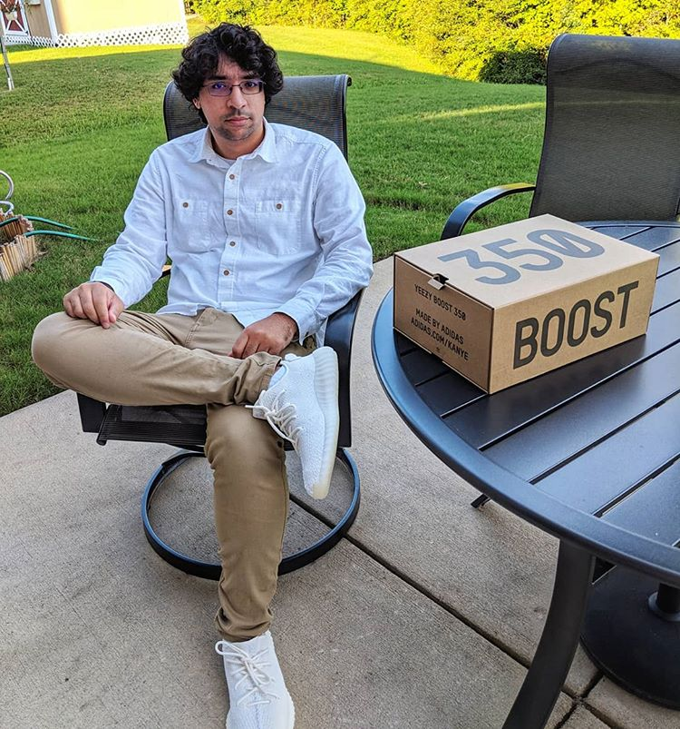
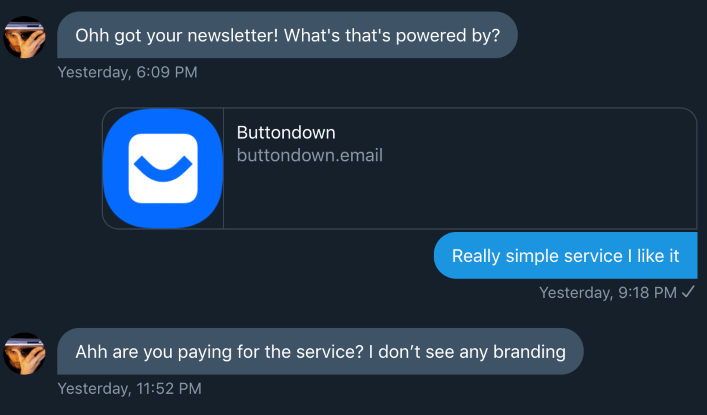

<Alert>
  This article was originally published to{' '}
  <AlertLink href="/news">the newsletter</AlertLink>.
</Alert>

For the past few years, I've been trying to figure out my personal brand; what type of content to create, where to post it, and how to manage both personal and professional brands. It also took me a long time to learn why a personal brand was important.

## People relate to people 😜 🤗

When we think about major companies such as Apple and Microsoft, we also visualize the faces of Steve Jobs and Bill Gates. We may even know a bit about their life stories and struggles to get their companies off the ground. A lot of our every day choices are not as objective and logical as we may think because we make emotional decisions that tend to relate to the people behind those brands, no matter how small or big.

### Why should you care? 🤨

I believe that we're living in a new age where company brands are not as influential anymore, and making it seem as if your company is faceless will be a bad marketing and business move going forward.

Let me give you a quick personal anecdote. In [October of last year](https://www.instagram.com/p/BocmuvbnchF/), I bought my first pair of Adidas Yeezy Boost sneakers, which are designed by music artist Kanye West. They cost \$220, which is a lot to fork up for a pair of shoes, but what's more interesting is that I own cheaper shoes which are more comfortable. 🤔

So what's the reason that I bought them? Mostly because of Kanye and his struggle of trying to break into a new industry with his designs. I appreciate him as an artist so much that I didn't have to make a fully logical decision.

Another example. What about these stats that [Pieter Levels tweeted](https://twitter.com/levelsio/status/1080443224194314241) about Joe Rogan's podcast?

> Joe Rogan's podcast is now is listened to 1.5+ billion times per year at around \$50-100M/year revenue.
>
> Independent and 100% owned by Joe, no networks, no > middle men and a 100M+ people audience. 👏

Joe started off as a comedian and has moved around different companies like Disney and the UFC. No one could have predicted that he would be running such a lucrative podcast today that would feature big names like Elon Musk 🤯

### It's all about audience 👀

All of this is the power of a personal brand, and more specifically what happens when you grow a large and loyal audience. Keep in mind that as a person, you can do whatever you want. As a faceless company, not so much.

I routinely talk with [Lasha Krikheli](https://twitter.com/LashaKrikheli) on Twitter, and one day he messaged me asking about my newsletter:

He asked what service I used for my newsletter, considering the lack of branding on it. I told him that I use [Buttondown](https://buttondown.email/), and the reason is because I saw [Kent C. Dodds](https://kentcdodds.com/) use it, a developer that I would say has grown an astounding personal brand. I especially loved what Lasha had to say about this:

> When you have a solid product and people like him promoting it, you probably don't need much to be generating revenue and profit.

Amen. The way that Buttondown does their marketing is by lack of it. People with strong audiences use it because it's a good product, and gladly promote it for free like I am doing right now.

## Don't overthink it 🧠

Once you've figured out that you need to be personable and put a face behind all of your companies and brands, you may begin to question yourself too much. What type of content should I produce? Am I being too awkward here? I can't possibly release something of this low quality.

My good friend [Leon Hitchens](https://twitter.com/leonhitchens) told me to just not overthink. It's simple advice but we all get in our heads way too often. I'm so glad that I uploaded cringy episodes of my podcast for the past year and a half because I've learned a lot and have gotten better each time.

## Stay consistent! 🗓

If there's any single takeaway from this, it's that you should stay consistent. Doesn't matter if you're creating content, products, or both. By documenting your progress and thoughts on a consistent basis, people begin to notice and will gladly follow your journey if they can relate in any way. It is also beneficial to yourself that you create a habit so that you won't think twice in the future, and simply continue to create.
