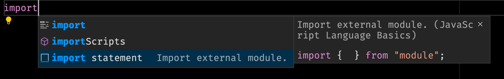

[Visual Studio Code](https://code.visualstudio.com/) (VS Code) is an extremely popular code editor that is mainly used for frontend web development. One of its features is a sophisticated code completion system known as [IntelliSense](https://code.visualstudio.com/docs/editor/intellisense).

IntelliSense works well... except with JavaScript module imports:

```js
import { useState } from 'react';
```

If you start to type `import` you have to decide _what_ you are importing first, instead of _where_ you are importing from. This unfortunately causes an issue for VS Code because it has no idea what to suggest for available imports.

Let's compare this syntax to other languages such as Python:

```py
from math import pi
```

Since you start the statement with `from math`, it is easier for the editor to give you suggestions on what is available for you to import from the module.

Okay, this is great news for Python, but what about our beloved JavaScript and Node.js code? Don't worry! I came across a fantastic solution for this.

## 💡 Solution: Fake reverse the import statement

If I could go back in time and make JavaScript's import syntax work like Python's, I would. However, we can work with what we got by trying to fake reverse the import.

You do this by simply typing `import` and waiting for a menu to pop up:



Make sure to select the `import statement` option by using the arrow keys and then pressing the `Enter` key. You should then see a template for an import statement:

```js
import {} from 'module';
```

The `module` text will be highlighted and selected, so you can start typing _where_ to import from first. After that, press the `Tab` key and the cursor will move in between the curly braces. Now, you can type _what_ you want to import and VS Code will be able to offer you suggestions.

---

Did you find this tip useful? Have your own tip to share? I would love to know, so [reach out on Twitter](https://twitter.com/sunnysinghio) or [send me an email](/contact).
